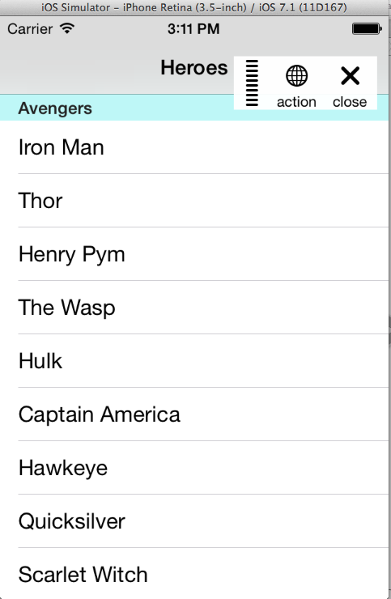

# Paramount

Like Flipboard FLEX, but allows custom action

[](https://travis-ci.org/onmyway133/Paramount)
[](http://cocoadocs.org/docsets/Paramount)
[](https://github.com/Carthage/Carthage)
[](http://cocoadocs.org/docsets/Paramount)
[](http://cocoadocs.org/docsets/Paramount)

## Usage

```swift
Manager.action = {
  print("action touched")
}

Manager.show()
```



## Installation

**Paramount** is available through [CocoaPods](http://cocoapods.org). To install
it, simply add the following line to your Podfile:

```ruby
pod 'Paramount'
```

**Paramount** is also available through [Carthage](https://github.com/Carthage/Carthage).
To install just write into your Cartfile:

```ruby
github "onmyway133/Paramount"
```

## Author

Khoa Pham, onmyway133@gmail.com

## Contributing

We would love you to contribute to **Paramount**, check the [CONTRIBUTING](https://github.com/onmyway133/Paramount/blob/master/CONTRIBUTING.md) file for more info.

## License

**Paramount** is available under the MIT license. See the [LICENSE](https://github.com/onmyway133/Paramount/blob/master/LICENSE.md) file for more info.
